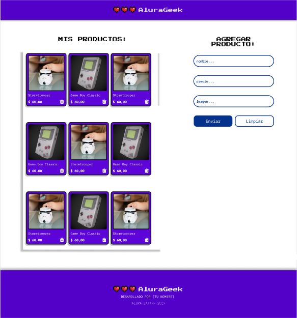

# Challenge AluraGeek
AluraGeek es una aplicación en donde te permite crear, listar o eliminar productos.

     

## :hammer: Funcionalidades
La página web tiene campos para la inserción de datos de productos y para el listado. A su vez, el usuario puede elegir si quiere eliminar el producto y el resultado se muestra en pantalla.

## :triangular_flag_on_post: Secciones

-  **Mis Productos:** Esta sección es donde se visualizan los productos existentes. Cada producto se presenta en una tarjeta (card).
-  **Agregar Producto:** En esta sección, se encuentra un formulario que permite agregar nuevos productos. Contiene tres campos de entrada para el nombre del producto, el precio y la imagen, incluye un contenedor de botones con un botón de enviar y un botón de limpiar.
 

## :pencil2: Implementación de la Fake API
JSON Server simula una API REST a partir de un archivo JSON. 
Permite desarrollar y probar aplicaciones frontend sin necesidad de una API real. **Facilita la creación rápida de endpoints para realizar operaciones CRUD (Crear, Leer, Actualizar, Eliminar) y simular respuestas de servidor, lo que agiliza el desarrollo de aplicaciones web.** Es útil para prototipado rápido, pruebas de concepto y desarrollo frontend independiente del backend.

Para eso, **cree el repositorio de la Fake API en Github y en vercel importo la API en donde se encuentran todos los productos guardados para poder hacer el consumo de esta API.**

##  :computer: Tecnologías utilizadas
Para la realización de este proyecto he utilizando:

-

## :loudspeaker: Desarrollo

### Trello :date:
Para desarrollar el proyecto, trabaje con el sistema ágil de desarrollo utilizando Trello de la siguiente forma:

1. La columna **Listos para iniciar** presenta las tarjetas con elementos que aun no fueron desarrollados.

2. En la columna **En Desarrollo** estarán las tarjetas que estés desarrollando en el momento.

3. En la columna **Pausado** estarán los elementos que has comenzado a trabajar pero necesitas detener por algún motivo.

4. Por fin, en la columna **Concluido** estarán los elementos ya finalizados.

:link:**Link de Trello:** [AluraGeek - ESP](https://trello.com/b/cU5tbBSG/new-alurageek-esp#)

### Figma :art:

El objetivo de este proyecto fue replicar el diseño presentado en Figma. A continuación, se detallan algunas de las adaptaciones que he realizado:

-  **Secciones de Mis Productos/Agregar Producto:** - Adapte las áreas donde los usuarios listan o agregan por formulario los productos para que se integren perfectamente con el diseño general del sitio.

-  **Responsive:** Para garantizar una experiencia agradable el proyecto se adapta automáticamente a diferentes dispositivos y tamaños de pantalla, incluyendo computadoras de escritorio, tablets y teléfonos móviles.

:link:**Link de Figma:** [AluraGeek - Figma](https://www.figma.com/design/eSIemWMmHT750XP4D810yz/AluraGeek---new?node-id=14-123&t=Iea6CQzoEB9yYwQ2-0)

## :pushpin: Acceso al proyecto

Puedes acceder al código fuente del proyecto [aquí](https://gabiif.github.io/aluraGeek/)